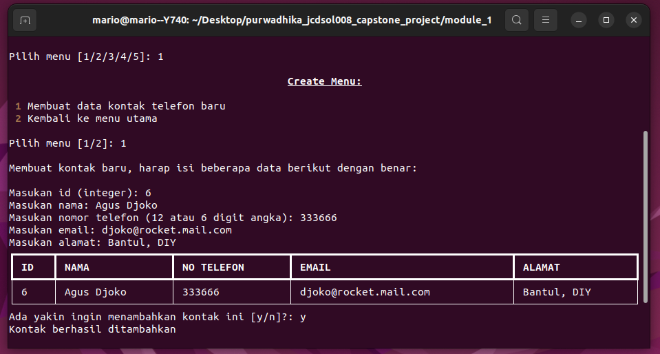
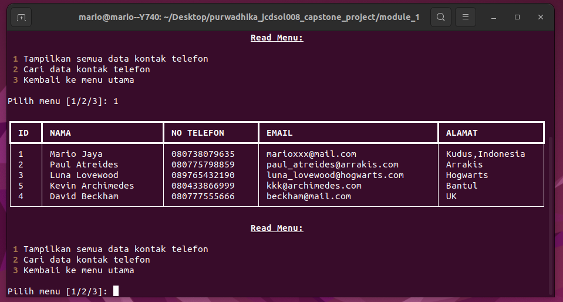
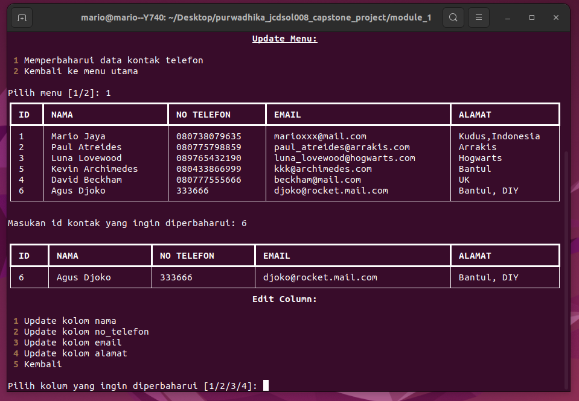
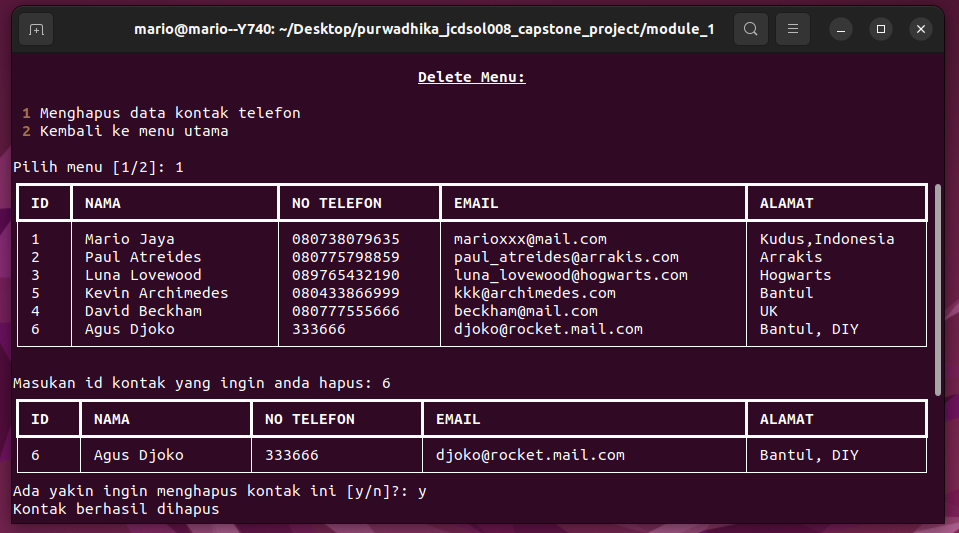

# Capstone Project Module 1 - Aplikasi CRUD Yellow Pages (Data Kontak Telefon)

## Requirements
1. python 3+
2. rich

## Installing Requirements
Install with `pip`:
```
pip install rich
```
Install with `conda`:
```
conda install -c conda-forge rich
```

## Usage
If you are using conda or virtual enviroment, you should activate the enviroment first where you have installed the `rich` package:
```
# e.g with conda
conda activate <env_name>
```
and after that you just call:
```
python cp_m1.py
```

## Screenshots
### Main Menu


### Create Menu


### Read Menu


### Update Menu


### Delete Menu
